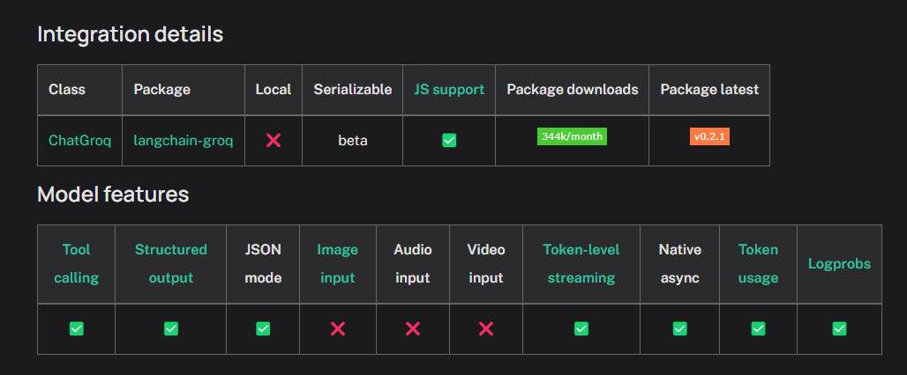

# COLD_MAIL_GENERATOR
Used Llama 3.1 for Cold Mail generator 

THIS PROJECT WILL WORKS IN THE FOLLOLLING WAY

1. Extract Text from the Career Page
2. That Extracted Data From the Career Page is Given input for our LLM ( Llama 3.1 )
3. Now The Llama will Generate the cold mail

The Llama is not used in Local Machine for this project.
Instead used 'GroqCloud' there is imported my Api Key for my Gen AI Project

DOCUMENTATION FOR 'ChatGroq' -  https://python.langchain.com/docs/integrations/chat/groq/

Used 'ChatGroq' for Building my LLM Application Easier
NOTE: Disadvantage of 'ChatGroq'

STEP 1 : Creating an VIRTUAL ENVIRONMENT 
         - Isolation: Dependencies specific to your project do not conflict with other projects or the system-wide Python environment.
         - Reproducibility: Makes it easier to replicate your setup on other machines or in production.
         - Manageability: Helps to keep your Python environment clean and organized.

         1. Check the python version : 'python --version' or 'python3 --version'
         2. Install virtualenv using pip: 'pip install virtualenv' or 'pip3 install virtualenv'
         3. Create a Virtual Environment - 'python -m venv env'
         4. Activate the Virtual Environment
            ' On Windows: '.\env\Scripts\activate' and On Mac and Linux: 'source venv/bin/activate'
         5. To Deactivate the Virtual Environment : deactivate

After ACTIVATED VIRTUAL ENVIRONMENT
STEP 2 : Install - ' pip install -qU langchain-groq '

STEP 3 :  INTEGRATING AN DATABASED 'Chromadb' - vector based.

ChromaDB (often just called "Chroma") is an open-source vector database designed for handling, storing, and querying high-dimensional vectors—especially useful in the context of AI applications that involve embeddings, such as large language models (LLMs) or computer vision systems. It allows developers to store embeddings (numerical representations of text, images, or other data) and then search for similar or related embeddings efficiently, which is essential for tasks like semantic search, recommendation systems, and other applications where similarity-based querying is needed.

         1. INSTALL CHROMA DB : 'pip install chromadb'
         2. DOCUMENTATION FOR CHROMA DB : 'https://docs.trychroma.com/getting-started'
         3. Create a file for chroma data base

TO better understand about vector refer this picture with the chroma db documentation

13:30
